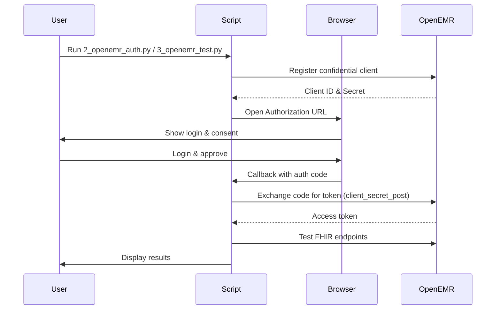

# OpenEMR FHIR API Testing Guide & Automation Suite

[](https://www.python.org/downloads/)
[](https://www.hl7.org/fhir/)
[](https://www.open-emr.org/)
[](LICENSE)

> **🚀 Complete Python automation suite** that automates OAuth2 authentication and tests FHIR API endpoints. Replaces manual cURL workflows with a browser-based login and programmatic validation.

---

## ⚠️ Current Status

**Dec 2025**

- **Authentication**: Registers a confidential (`private`) client and completes OAuth2 Authorization Code flow using `client_secret_post`.
- **Scopes**: Requests `user/Patient.read` and `user/Patient.write` in addition to `openid`, `offline_access`, `api:oemr`, and `api:fhir`.
- **Read Access**: Verified via `Search Patients` test.
- **Write Operations**: Patient creation works successfully. Encounter creation returns 404 as it's not supported in OpenEMR 7.0.3 (planned for future versions).

---

## 📑 Table of Contents

- [Quick Start](#-quick-start)
- [Deployment](#-deployment)
- [Automation Overview](#-automation-overview)
- [How It Works](#-how-it-works)
- [Configuration](#-configuration)
- [Limitations](#-limitations)
- [Troubleshooting](#-troubleshooting)
- [Repository Structure](#-repository-structure)
- [Enhanced Features](#-enhanced-features)
- [License](#-license)

---

## 🚀 Quick Start

Get started testing OpenEMR FHIR APIs locally.

### Step 1: Check Prerequisites
Validates Python environment, dependencies, and connectivity to OpenEMR endpoints.
```bash
python3 1_check_prerequisites.py
```
Expected: `✅ All checks passed`

### Step 2: Install Dependencies
```bash
pip3 install -r requirements.txt
```

### Step 3: Start OpenEMR Services (Required)
Before running authentication and tests, start the OpenEMR services:
```bash
# Generate SSL certificates
chmod +x generate_certs.sh
./generate_certs.sh

# Start OpenEMR with Docker
docker compose up -d
```
Wait 3-5 minutes for OpenEMR to initialize completely.

### Step 4: Configure OpenEMR (Required)
Enable API services in OpenEMR admin interface:
1. Access OpenEMR at `https://localhost:8443`
2. Log in as admin
3. Go to: **Administration → Config → Connectors**
4. Enable: **"Enable OpenEMR Standard FHIR REST API"**
5. Set **Site Address** to: `https://localhost:8443`
6. Save changes

### Step 5: Run Automated Tests

The suite runs in two steps:

1) Authenticate
```bash
python3 2_openemr_auth.py
```
Registers the app, opens the browser for login, and saves credentials to `.env`.

2) Run Tests
```bash
python3 3_openemr_test.py
```
Reads credentials and performs FHIR API tests.

Once Docker is running, execute these commands in sequence:
```bash
# Generate certificates
chmod +x generate_certs.sh
./generate_certs.sh

# Start OpenEMR services
docker compose up -d

# Wait for services to be ready (2-5 minutes)
# Then run the authentication and test scripts
python3 2_openemr_auth.py
python3 3_openemr_test.py
```

---

## 🐳 Deployment

Run the OpenEMR environment locally using Docker and an Nginx reverse proxy terminating HTTPS on `8443`.

### 3) Verify Deployment
- URL: `https://localhost:8443`
- Login: Use your OpenEMR credentials. Fresh installs may prompt initial setup.


## 🎯 Automation Overview

Replaces manual cURL workflows with modular Python scripts and a browser-based OAuth2 flow.

| Feature | Manual cURL | Python Automation |
| :--- | :--- | :--- |
| Registration | JSON payload construction | ✅ Automatic (API-based) |
| Auth | Copy-paste URLs & codes | ✅ Automatic (Browser + local callback) |
| Token Mgmt | Export env vars | ✅ Automatic (exchange) |
| Testing | One-off cURL calls | ✅ Endpoints tested in sequence |
| Validation | Manual JSON reading | ✅ Programmatic validation |

---

## 🔄 How It Works

### Flow


---

## ⚙️ Configuration

### What Gets Tested
Scenarios attempted:
- Patient demographics (create/search)
- Clinical encounter operations (read only - creation not supported in current OpenEMR version)
- Clinical observations (vitals, notes) - dependent on encounter creation
- Prescribing (MedicationRequest) - dependent on encounter creation

### Auth Script Settings
Edit the `Config` class in `2_openemr_auth.py`:

```python
class Config:
    BASE_URL = "https://localhost:8443"
    REDIRECT_URI = "http://127.0.0.1:3000/callback"
    CALLBACK_PORT = 3000
    SCOPES = "openid offline_access api:oemr api:fhir user/Patient.read user/Patient.write"
    APP_TYPE = "private"
    AUTH_METHOD = "client_secret_post"
```

### Script Architecture
- `2_openemr_auth.py` (`OpenEMRAuth`)
  - `register_application()`: Register OAuth2 client
  - `get_authorization_code()`: Browser login & local callback
  - `exchange_code_for_token()`: Token exchange (confidential client)
  - `save_to_env()`: Persist credentials to `.env`
- `3_openemr_test.py` (`TestRunner`)
  - `load_env()`: Load `.env`
  - `run()`: Execute FHIR endpoint tests

### Enable the Client in OpenEMR (Required)
- After registration, newly created clients may be disabled by default. You **must** enable the client under `Admin → System → API Clients`.
- Look for the client with name "POC Testing App" and ensure it is enabled.
- Without enabling the client, token exchange will fail with "invalid_client" error.

### Discovery & Endpoints
- OIDC Discovery: `<BASE_URL>/oauth2/default/.well-known/openid-configuration`
- Registration: `<BASE_URL>/oauth2/default/registration`
- Authorization: `<BASE_URL>/oauth2/default/authorize`
- Token: `<BASE_URL>/oauth2/default/token`

### Scope Conventions
- SMART scopes often use capitalized FHIR resource names, e.g., `system/Patient.read`, `user/Patient.write`.
- OpenEMR may support different scope formats. The current implementation uses `user/Patient.read` and `user/Patient.write`.
- Not all FHIR resources may be enabled in every OpenEMR instance. If you receive "invalid_scope" errors, check your OpenEMR configuration.

---

## 🚧 Limitations

### Current OpenEMR Version Support
- **OpenEMR Version**: 7.0.3
- **FHIR R4 Support**: Partial implementation with US Core 8.0 compliance
- **SMART on FHIR**: v2.2.0 support

### Resource Operation Limitations
- **Patient Resources**: ✅ Full CRUD support (Create, Read, Update, Delete)
- **Encounter Resources**: ❌ Read/Search only (Create/Update operations not yet implemented)
- **Appointment Resources**: ❌ Read/Search only (Create/Update operations not yet implemented)
- **Other Resources**: Varies by resource type

### Technical Limitations
- **Encounter Creation**: Not available in OpenEMR 7.0.3; planned for future releases (targeted for version 7.0.4+)
- **Native API Access**: Requires different authentication scopes than FHIR API
- **Appointment Creation**: Not available through FHIR API in current version

### Future Enhancements
According to OpenEMR GitHub issue #8639, Create, Update, and Delete operations for FHIR resources (including Encounter and Appointment) are planned as future enhancements after basic Read/Search functionality is established with SMART on FHIR v2.2.0 scope syntax.

The test script handles these limitations gracefully by continuing with other tests when one resource operation fails.

---


## 📁 Repository Structure

Top-level layout for quick orientation:

- `1_check_prerequisites.py`: Environment checks (Python, endpoints)
- `2_openemr_auth.py`: OAuth2 client registration, browser auth, token exchange, `.env` save
- `3_openemr_test.py`: FHIR tests (read/write scenarios) - Enhanced with better error handling and ID extraction
- `requirements.txt`: Python dependencies
- `docker-compose.yml`: OpenEMR app, DB, and HTTPS reverse proxy
- `nginx/conf.d/default.conf`: Nginx site config (SSL termination, proxy to app)
- `nginx/certs/`: Self-signed TLS certs generated locally
- `generate_certs.sh`: Helper to generate `cert.pem`/`key.pem`

---