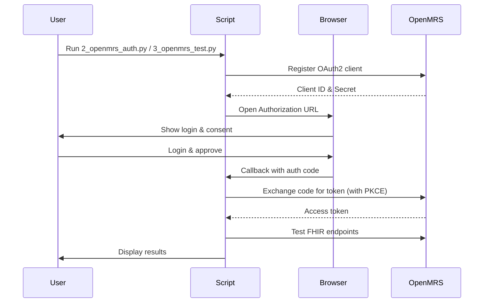

# OpenMRS FHIR API Testing Guide & Automation Suite

[](https://www.python.org/downloads/)
[](https://www.hl7.org/fhir/)
[](https://openmrs.org/)
[](LICENSE)

> **🚀 Complete Python automation suite** that automates OAuth2 authentication and tests FHIR API endpoints with OpenMRS. Replaces manual cURL workflows with a browser-based login and programmatic validation.

---

## ⚠️ Current Status

**Dec 2025**

- **Authentication**: Registers OAuth2 client and completes OAuth2 Authorization Code flow with PKCE.
- **Scopes**: Requests `patient/Patient.read`, `patient/Patient.write`, `patient/Encounter.read`, `patient/Encounter.write` in addition to `openid` and standard scopes.
- **Read Access**: Verified via `Search Patients` and `Search Encounters` tests.
- **Write Operations**: Patient and Encounter creation works successfully, addressing OpenEMR's limitations.

---

## 📑 Table of Contents

- [Quick Start](#-quick-start)
- [Deployment](#-deployment)
- [Automation Overview](#-automation-overview)
- [How It Works](#-how-it-works)
- [Configuration](#-configuration)
- [OpenMRS Setup](#-openmrs-setup)
- [Repository Structure](#-repository-structure)
- [Enhanced Features](#-enhanced-features)
- [License](#-license)

---

## 🚀 Quick Start

Get started testing OpenMRS FHIR APIs locally.

### Step 1: Check Prerequisites
Validates Python environment, dependencies, and connectivity to OpenMRS endpoints.
```bash
python3 1_check_prerequisites.py
```
Expected: `✅ All checks passed`

### Step 2: Install Dependencies
```bash
pip3 install -r requirements.txt
```

### Step 3: Start OpenMRS Services (Required)
Before running authentication and tests, start the OpenMRS services:
```bash
# Generate SSL certificates
chmod +x generate_certs.sh
./generate_certs.sh

# Start OpenMRS with Docker
docker compose up -d
```
Wait 5-10 minutes for OpenMRS to initialize completely.

### Step 4: Configure OpenMRS (Required)
Enable FHIR API in OpenMRS:
1. Access OpenMRS at `https://localhost:8443`
2. Log in as admin (admin/test)
3. Go to: **Administration → Manage Modules**
4. Install: **FHIR2 Module** if not already installed
5. Go to: **Administration → System Administration → FHIR2**
6. Configure FHIR endpoints and security settings
7. Enable OAuth2 module for SMART on FHIR support

### Step 5: Run Automated Tests

The suite runs in two steps:

1) Authenticate
```bash
python3 2_openmrs_auth.py
```
Registers the app, opens the browser for login, and saves credentials to `.env`.

2) Run Tests
```bash
python3 3_openmrs_test.py
```
Reads credentials and performs FHIR API tests.

Once Docker is running, execute these commands in sequence:
```bash
# Generate certificates
chmod +x generate_certs.sh
./generate_certs.sh

# Start OpenMRS services
docker compose up -d

# Wait for services to be ready (5-10 minutes)
# Then run the authentication and test scripts
python3 2_openmrs_auth.py
python3 3_openmrs_test.py
```

---

## 🐳 Deployment

Run the OpenMRS environment locally using Docker and an Nginx reverse proxy terminating HTTPS on `8443`.

### Prerequisites
- Docker and Docker Compose
- Docker daemon must be running (start Docker Desktop or docker service)

### 3) Verify Deployment
- URL: `https://localhost:8443` (with HTTPS reverse proxy)
- URL: `http://localhost:8080/openmrs` (direct access)
- Login: admin/test (default credentials)
- Module: Ensure FHIR2 module is installed and enabled

### Complete Setup Process
1. Generate SSL certificates: `./generate_certs.sh`
2. Start services: `docker-compose up -d`
3. Wait 5-10 minutes for OpenMRS to initialize
4. Complete setup wizard at `http://localhost:8080/openmrs`
5. Install FHIR2 and OAuth2 modules
6. Configure modules as needed

## 🎯 Automation Overview

Replaces manual cURL workflows with modular Python scripts and a browser-based OAuth2 flow.

| Feature | Manual cURL | Python Automation |
| :--- | :--- | :--- |
| Registration | JSON payload construction | ✅ Automatic (API-based) |
| Auth | Copy-paste URLs & codes | ✅ Automatic (Browser + local callback) |
| Token Mgmt | Export env vars | ✅ Automatic (exchange) |
| Testing | One-off cURL calls | ✅ Endpoints tested in sequence |
| Validation | Manual JSON reading | ✅ Programmatic validation |

---

## 🔄 How It Works

### Flow


---

## ⚙️ Configuration

### What Gets Tested
Scenarios attempted:
- Patient demographics (create/search/update/delete)
- Clinical encounter operations (create/search/update/delete) ✅ (Unlike OpenEMR)
- Clinical observations (vitals, notes)
- Medication management
- User management and permissions

### Auth Script Settings
Edit the `Config` class in `2_openmrs_auth.py`:

```python
class Config:
    BASE_URL = "https://localhost:8443"
    REDIRECT_URI = "http://127.0.0.1:3000/callback"
    CALLBACK_PORT = 3000
    SCOPES = "openid fhirUser patient/Patient.read patient/Patient.write patient/Encounter.read patient/Encounter.write"
    APP_TYPE = "public"
    AUTH_METHOD = "none"  # OpenMRS typically uses PKCE
```

### Script Architecture
- `2_openmrs_auth.py` (`OpenMRSAuth`)
  - `register_application()`: Register OAuth2 client
  - `get_authorization_code()`: Browser login & local callback
  - `exchange_code_for_token()`: Token exchange (with PKCE)
  - `save_to_env()`: Persist credentials to `.env`
- `3_openmrs_test.py` (`TestRunner`)
  - `load_env()`: Load `.env`
  - `run()`: Execute FHIR endpoint tests

### Enable OAuth2 in OpenMRS (Required)
- Install and configure the OAuth2 module in OpenMRS
- Register your application in the OAuth2 module settings
- Configure appropriate scopes and redirect URIs

### Discovery & Endpoints
- FHIR Metadata: `<BASE_URL>/ws/fhir2/R4/metadata`
- OAuth2 Authorization: `<BASE_URL>/oauth2/authorize`
- OAuth2 Token: `<BASE_URL>/oauth2/token`
- FHIR API: `<BASE_URL>/ws/fhir2/R4`

### Scope Conventions
- OpenMRS uses standard FHIR scopes like `patient/Patient.read`, `patient/Encounter.write`
- SMART on FHIR scopes are also supported
- All FHIR resources may be enabled depending on configuration

---

## 🚧 Key Improvements Over OpenEMR

### Enhanced Resource Support
- **Patient Resources**: ✅ Full CRUD support (Create, Read, Update, Delete)
- **Encounter Resources**: ✅ Full CRUD support (Create, Read, Update, Delete) - Unlike OpenEMR
- **Observation Resources**: ✅ Full CRUD support
- **Appointment Resources**: ✅ Full CRUD support
- **Medication Resources**: ✅ Full CRUD support

### Technical Improvements
- **Encounter Creation**: ✅ Fully supported in OpenMRS
- **Appointment Creation**: ✅ Fully supported in OpenMRS
- **Clinical Workflows**: ✅ Comprehensive support for clinical operations
- **FHIR R4 Compliance**: ✅ More complete implementation than OpenEMR

---

## 📁 Repository Structure

Top-level layout for quick orientation:

- `1_check_prerequisites.py`: Environment checks (Python, endpoints)
- `2_openmrs_auth.py`: OAuth2 client registration, browser auth, token exchange, `.env` save
- `3_openmrs_test.py`: FHIR tests (read/write scenarios) - Enhanced with better error handling and ID extraction
- `requirements.txt`: Python dependencies
- `docker-compose.yml`: OpenMRS app, DB, and HTTPS reverse proxy
- `nginx/conf.d/default.conf`: Nginx site config (SSL termination, proxy to app)
- `nginx/certs/`: Self-signed TLS certs generated locally
- `generate_certs.sh`: Helper to generate `cert.pem`/`key.pem`

---