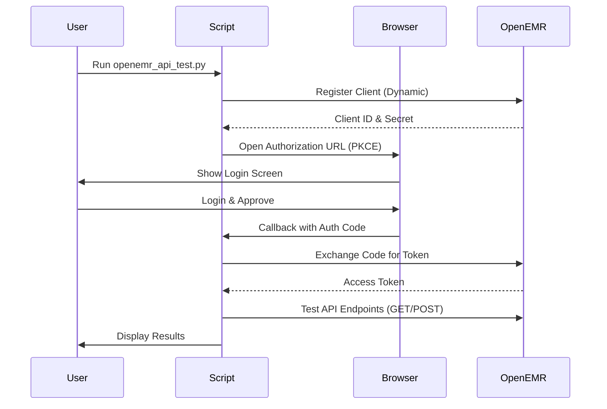

# OpenEMR FHIR API Testing Guide & Automation Suite

[](https://www.python.org/downloads/)
[](https://www.hl7.org/fhir/)
[](https://www.open-emr.org/)
[](LICENSE)

> **🚀 Complete Python automation suite** that automates OAuth2 authentication and tests all FHIR API endpoints. No more manual cURL commands!

---

## ⚠️ Critical Update: Authentication Fix & Access Status

**Current Status (Dec 2025): Authentication Solved, Read-Only Access**

The automation script has been updated to resolve the "Client authentication failed" error.
- **✅ Authentication**: Uses `native` (Public) client with **PKCE** and `client_secret_post`. Successfully obtains tokens.
- **✅ Verification**: Includes a `search_patients` test to confirm API Read access.
- **⚠️ Write Limitation**: Due to OpenEMR environment restrictions, `native` clients are currently blocked from requesting `user/` scopes. This means **write operations** (creating patients, etc.) will be skipped or return `401 Unauthorized`.

To enable full write automation, the OpenEMR server must be configured to allow `user/` scopes for public clients or fix confidential client authentication.

---

## 📑 Table of Contents

- [Quick Start](#-quick-start)
- [Automation Overview](#-automation-overview)
- [How It Works](#-how-it-works)
- [Detailed Usage & Configuration](#-detailed-usage--configuration)
- [Troubleshooting](#-troubleshooting)
- [Legacy API Reference (cURL)](#-legacy-api-reference-curl-examples)

---

## 🚀 Quick Start

Get started testing OpenEMR FHIR APIs in under 2 minutes.

### Step 1: Check Prerequisites
```bash
python3 check_prerequisites.py
```
*Expected: "✅ All checks passed"*

### Step 2: Install Dependencies
```bash
pip3 install -r requirements.txt
```

### Step 3: Run Automated Tests
```bash
python3 openemr_api_test.py
```

**What happens:**
1.  **Browser Opens**: Log in as admin and approve consent.
2.  **Auth Success**: Script exchanges code for token using PKCE.
3.  **Tests Run**: 
    *   Verifies Read Access (Search Patients).
    *   Attempts Write Operations (e.g. Create Patient) - *Note: Will report errors if permissions are restricted.*
4.  **Summary**: Displays results and saved credentials.

---

## 🎯 Automation Overview

This suite replaces complex manual cURL workflows with a single Python script.

| Feature | Manual cURL | **Python Automation** |
| :--- | :--- | :--- |
| **Registration** | JSON payload construction | ✅ **Automatic** (API-based) |
| **Auth** | Copy-pasting URLs & Codes | ✅ **Automatic** (Browser launch + Callback server) |
| **Token Mgmt** | Manual export vars | ✅ **Automatic** (Exchange & Refresh) |
| **Testing** | Individual cURL commands | ✅ **All endpoints tested in sequence** |
| **Validation** | Manual JSON reading | ✅ **Programmatic validation** |

---

## 🔄 How It Works

### Complete Automation Flow



### Execution Timeline
*   **0:00** Script starts & Registers App
*   **0:02** Browser opens for Auth
*   **0:05** Token Acquired
*   **0:06** Read Access Verified
*   **0:07+** Write Scenarios Tested (Patient, Appointment, Encounter, etc.)

---

## 🧪 Detailed Usage & Configuration

### What Gets Tested
The script attempts to cover the following scenarios:
1.  **Scenario A: Patient Demographics** (Create/Search Patient)
2.  **Scenario B: Appointment Scheduling** (Book Appointment)
3.  **Scenario C: Clinical Encounter** (Encounter, Vitals, Notes)
4.  **Scenario D: Prescribing** (MedicationRequest, ServiceRequest)

### Configuration
Edit the `Config` class in `openemr_api_test.py` to customize:

```python
class Config:
    BASE_URL = "https://localhost:8443"
    # Scopes reduced for Native client compatibility
    SCOPES = "openid offline_access api:oemr api:fhir"
    # Change to 'private' and add user/ scopes if environment allows
    APP_TYPE = "native" 
```

### Script Architecture
*   `OpenEMRAPI` class handles all logic.
*   `register_application()`: Performs dynamic client registration.
*   `get_authorization_code()`: Starts local HTTP server to capture callback.
*   `exchange_code_for_token()`: Implements PKCE and Token Exchange.
*   Scenario methods (`create_patient`, etc.) implment specific FHIR operations.

---

## 🔧 Troubleshooting

### 401 Unauthorized on Create Patient
*   **Cause**: The current `native` client cannot obtain `user/` scopes required for writing data.
*   **Solution**: This is a known limitation of the current OpenEMR configuration. Validate success via the `Search Patients` test (Read Access). To fix, server admin must allow public clients to request user scopes.

### Connection Refused
*   Ensure OpenEMR is running (`docker ps`).
*   Verify `BASE_URL` in `Config`.

### Browser Doesn't Open
*   Manually copy the URL printed in the terminal.

---

## 📖 Legacy API Reference (Link)

For manual cURL commands and legacy documentation, please refer to the `README.md` history or the original documentation provided by OpenEMR.

*(Note: The previous cURL examples have been superseded by the `openemr_api_test.py` script.)*
