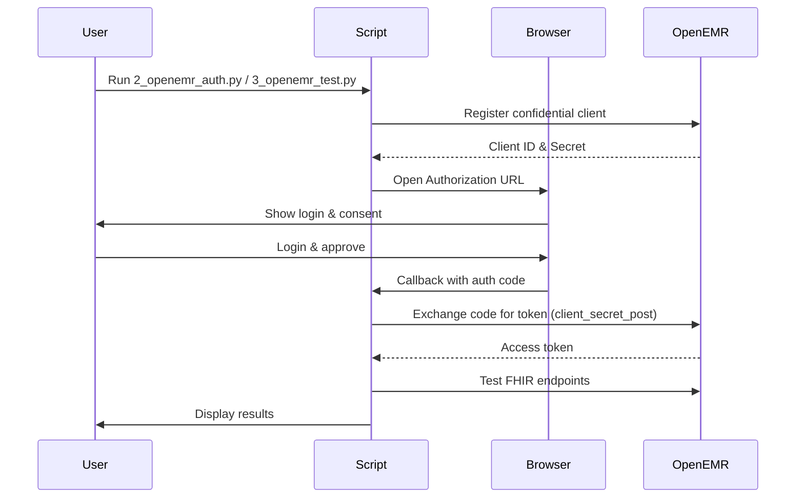

# OpenEMR FHIR API Testing Guide & Automation Suite

[](https://www.python.org/downloads/)
[](https://www.hl7.org/fhir/)
[](https://www.open-emr.org/)
[](LICENSE)

> **🚀 Complete Python automation suite** that automates OAuth2 authentication and tests FHIR API endpoints. Replaces manual cURL workflows with a browser-based login and programmatic validation.

---

## ⚠️ Current Status

**Dec 2025**

- **Authentication**: Registers a confidential (`private`) client and completes OAuth2 Authorization Code flow using `client_secret_post`.
- **Scopes**: Requests `user/Patient.read` and `user/Patient.write` in addition to `openid`, `offline_access`, `api:oemr`, and `api:fhir`.
- **Read Access**: Verified via `Search Patients` test.
- **Write Operations**: Attempted in sequence (Patient, Appointment, Encounter, Vitals, Note, Medication). Success depends on server configuration and granted scopes. If the server denies write scopes, these calls may return `401/403`.

---

## 📑 Table of Contents

- [Quick Start](#-quick-start)
- [Deployment](#-deployment)
- [Automation Overview](#-automation-overview)
- [How It Works](#-how-it-works)
- [Configuration](#-configuration)
- [Troubleshooting](#-troubleshooting)
- [Repository Structure](#-repository-structure)
- [License](#-license)

---

## 🚀 Quick Start

Get started testing OpenEMR FHIR APIs locally.

### Step 1: Check Prerequisites
Validates Python environment, dependencies, and connectivity to OpenEMR endpoints.
```bash
python3 1_check_prerequisites.py
```
Expected: `✅ All checks passed`

### Step 2: Install Dependencies
```bash
pip3 install -r requirements.txt
```

### Step 3: Start OpenEMR Services (Required)
Before running authentication and tests, start the OpenEMR services:
```bash
# Generate SSL certificates
chmod +x generate_certs.sh
./generate_certs.sh

# Start OpenEMR with Docker
docker compose up -d
```
Wait 3-5 minutes for OpenEMR to initialize completely.

### Step 4: Run Automated Tests

The suite runs in two steps:

1) Authenticate
```bash
python3 2_openemr_auth.py
```
Registers the app, opens the browser for login, and saves credentials to `.env`.

2) Run Tests
```bash
python3 3_openemr_test.py
```
Reads credentials and performs FHIR API tests.

### Note on Current Environment
⚠️ **Docker Required**: This PoC requires Docker to run the OpenEMR services. If Docker is not available or not running, the authentication and test scripts will not be able to connect to the OpenEMR API endpoints. The prerequisites check can be run without Docker, but full functionality requires the OpenEMR services to be running.

#### Starting Docker (if not running)
- **On macOS**: Launch Docker Desktop from Applications folder
- **On Linux**: Start the Docker service with `sudo systemctl start docker`
- **Verify**: Run `docker info` - you should see both Client and Server information

Once Docker is running, execute these commands in sequence:
```bash
# Generate certificates
chmod +x generate_certs.sh
./generate_certs.sh

# Start OpenEMR services
docker compose up -d

# Wait for services to be ready (2-5 minutes)
# Then run the authentication and test scripts
python3 2_openemr_auth.py
python3 3_openemr_test.py
```

---

## 🐳 Deployment

Run the OpenEMR environment locally using Docker and an Nginx reverse proxy terminating HTTPS on `8443`.

### Prerequisites: Ensure Docker is Running
Before starting, make sure Docker daemon is running:
```bash
# Check if Docker is available
docker info

# On macOS, start Docker Desktop if needed
# On Linux, start Docker service: sudo systemctl start docker
```

### 1) Generate SSL Certificates
Generate self-signed certificates for local HTTPS:
```bash
chmod +x generate_certs.sh
./generate_certs.sh
```
Creates `nginx/certs/cert.pem` and `nginx/certs/key.pem`.

### 2) Start Services
Pull images and start containers:
```bash
# Using modern Docker Compose syntax
docker compose up -d

# Or if using older Docker versions
docker-compose up -d
```
Wait a few minutes for OpenEMR to initialize (database population).

### 3) Verify Deployment
- URL: `https://localhost:8443`
- Login: Use your OpenEMR credentials. Fresh installs may prompt initial setup.

### 4) Stop Services
```bash
docker compose down
# or
docker-compose down
```

### Troubleshooting
- **"Not Found" error**: Ensure Docker daemon is running and Docker Compose plugin is installed
- **"Permission denied"**: On Linux, run with sudo or add user to docker group: `sudo usermod -aG docker $USER`
- **Certificate issues**: If you get SSL warnings, the self-signed certificates are expected for local testing

---

## 🎯 Automation Overview

Replaces manual cURL workflows with modular Python scripts and a browser-based OAuth2 flow.

| Feature | Manual cURL | Python Automation |
| :--- | :--- | :--- |
| Registration | JSON payload construction | ✅ Automatic (API-based) |
| Auth | Copy-paste URLs & codes | ✅ Automatic (Browser + local callback) |
| Token Mgmt | Export env vars | ✅ Automatic (exchange) |
| Testing | One-off cURL calls | ✅ Endpoints tested in sequence |
| Validation | Manual JSON reading | ✅ Programmatic validation |

---

## 🔄 How It Works

### Flow



### Execution Timeline
- 0:00 Register client
- 0:02 Browser opens
- 0:05 Token acquired
- 0:06 Read access verified
- 0:07+ Write scenarios attempted

---

## ⚙️ Configuration

### What Gets Tested
Scenarios attempted:
- Patient demographics (create/search)
- Clinical encounter (encounter, vitals, notes)
- Prescribing (MedicationRequest)

### Auth Script Settings
Edit the `Config` class in `2_openemr_auth.py`:

```python
class Config:
    BASE_URL = "https://localhost:8443"
    REDIRECT_URI = "http://127.0.0.1:3000/callback"
    CALLBACK_PORT = 3000
    SCOPES = "openid offline_access api:oemr api:fhir user/Patient.read user/Patient.write"
    APP_TYPE = "private"
    AUTH_METHOD = "client_secret_post"
```

### Script Architecture
- `2_openemr_auth.py` (`OpenEMRAuth`)
  - `register_application()`: Register OAuth2 client
  - `get_authorization_code()`: Browser login & local callback
  - `exchange_code_for_token()`: Token exchange (confidential client)
  - `save_to_env()`: Persist credentials to `.env`
- `3_openemr_test.py` (`TestRunner`)
  - `load_env()`: Load `.env`
  - `run()`: Execute FHIR endpoint tests

### Enable the Client in OpenEMR (Required)
- After registration, newly created clients may be disabled by default. You **must** enable the client under `Admin → System → API Clients`.
- Look for the client with name "POC Testing App" and ensure it is enabled.
- Without enabling the client, token exchange will fail with "invalid_client" error.

### Discovery & Endpoints
- OIDC Discovery: `<BASE_URL>/oauth2/default/.well-known/openid-configuration`
- Registration: `<BASE_URL>/oauth2/default/registration`
- Authorization: `<BASE_URL>/oauth2/default/authorize`
- Token: `<BASE_URL>/oauth2/default/token`

### Scope Conventions
- SMART scopes often use capitalized FHIR resource names, e.g., `system/Patient.read`, `user/Patient.write`.
- OpenEMR may support different scope formats. The current implementation uses `user/Patient.read` and `user/Patient.write`.
- Not all FHIR resources may be enabled in every OpenEMR instance. If you receive "invalid_scope" errors, check your OpenEMR configuration.

---

## 🔧 Troubleshooting

### 401/403 on Write Operations
- Cause: Missing or denied `system/*` or `user/*` write scopes
- Fix: Adjust server configuration to grant appropriate scopes; confirm client type is allowed to request them

### Connection Refused
- Ensure OpenEMR is running (`docker ps`)
- Verify `BASE_URL` in `Config`

### Browser Doesn't Open
- Manually copy the URL printed in the terminal

---

## 📁 Repository Structure

Top-level layout for quick orientation:

- `1_check_prerequisites.py`: Environment checks (Python, endpoints)
- `2_openemr_auth.py`: OAuth2 client registration, browser auth, token exchange, `.env` save
- `3_openemr_test.py`: FHIR tests (read/write scenarios) - Enhanced with better error handling and ID extraction
- `requirements.txt`: Python dependencies
- `docker-compose.yml`: OpenEMR app, DB, and HTTPS reverse proxy
- `nginx/conf.d/default.conf`: Nginx site config (SSL termination, proxy to app)
- `nginx/certs/`: Self-signed TLS certs generated locally
- `generate_certs.sh`: Helper to generate `cert.pem`/`key.pem`

## 🛠️ Enhanced Features

### Improved Test Script (`3_openemr_test.py`)
- Better error handling to prevent script crashes
- Enhanced ID extraction from multiple response locations (JSON body, Location header)
- Sequential validation starting with authentication check
- Improved debugging output for troubleshooting
- Resource dependency checks to ensure proper creation order

### Authentication Script (`2_openemr_auth.py`)
- Fixed JWKS generation and usage
- Improved authorization URL construction
- Better error handling and debugging information

## 🪪 License

MIT License. See `LICENSE`.
